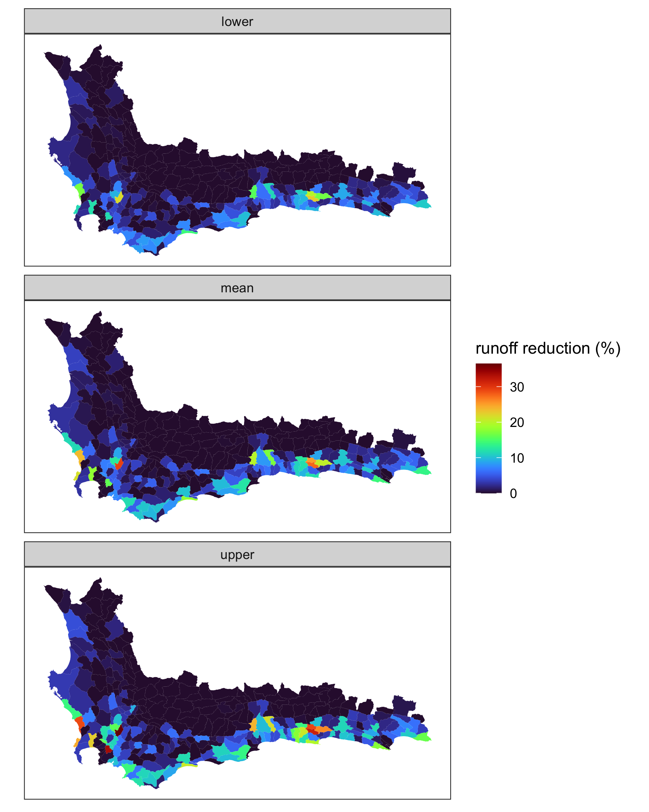

## Analysis of streamflow reductions by Alien Invasive Plants in the Cape Floristic Region

## _Glenn Moncrieff, Jasper Slingsby and Dave Le Maitre_

### SAEON fynbos node and CSIR

Updated estimates of streamflow reduction by Alien Invasive Plants in the Cape Floristic Region. Methodology based on:  
**D Le Maitre, G G Forsyth, S Dzikiti and M B Gush. 2016. Estimates of the impacts of invasive alien plants on water flows in South Africa. Water SA 42: 659 - 672.**

Updates to the Le Maitre 2016 Methodology include:  
- Improved estimates of precipitation with uncertatinty  
- Uncertainty in Rainfall-Streamflow reduction curves based on reanalysis of original paired catchment data
- Veld age estimated from fire history
- Uncertainty in model parameters propagated to final streamflow reduction estimates

## To run:

Download this repo
`git clone https://github.com/GMoncrieff/streamflow-reduction.git`

You may need to copy some input data:
`gsutil -m cp -r gs://stan-data/data streamflow-reduction`  
  
Make sure you have read/write permissions for this directory. You may need to run:
`chmod -R 777 streamflow-reduction`  
  
Get container
`docker pull glennwithtwons/streamflow`  

Run interactivty in Rstudio
`sudo docker run -d  -e PASSWORD=guest -p 8780:8787 -v /home/glennmoncrieff/streamflow-reduction/:/home/rstudio/streamflow -e ROOT=TRUE --workdir /home/rstudio/ glennwithtwons/streamflow`
  
## Results available at:
**work in progress**

